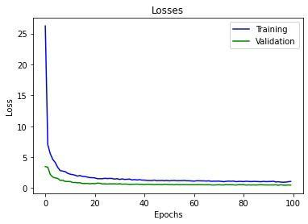

<style>
body { font-size: 13px; }
</style>
# Exercise 1 – Imitation Learning
Submitted by: Shoumik Majumdar and Shubham Arora

The experiment - observation table is at the end of the report

## 1.1 Network design

### b) Training
 > Q. Why is is necessary to divide the data into batches?
 
 In most cases where we have large amounts of data for training a model, it is infeasible to feed all the data to the algorithm in one pass. This is due to size of dataset and memory limitations. Hence, data is divided into batches to make it feasible for training. (fit training data into computers memory)

 > Q. What is an epoch?
 
 Epoch is a unit to describe when the entire dataset is passed forward and backward through the neural network exactly once.

 No of epochs is a hyperparameters that states how many times the learning algorithm will work through the entire dataset.

 > Q. What do lines 43 to 48 do?

 Line 43 - 48 perform a forward pass with the input batch, calculate the cross entropy loss between the predicted and ground truth labels. Then the gradients are set to 0 so that new ones can be calculated for the next batch. loss.backward() computes the gradients for all parameters and optimizer.step() updates the weights using the gradients and learning rate.


### c) Classification Network

> Q. Have a look at the actions provided by the expert imitations, there are  three controls: steer, gas and brake. Which values do they take? 

In the default dataset, the following 9 classes were identified:
actions : steer, gas, brake
steer values:  {0.0, 1.0, -1.0}
gas values:  {0.0, 0.5}
brake values:  {0.0, 0.8}
9 classes of actions
action values:  {
    0, (0.0, 0.0, 0.0), no_op 
    1, (0.0, 0.5, 0.0), gas
    2, (-1.0, 0.5, 0.0), gas_left
    3, (-1.0, 0.0, 0.0), steer_left
    4, (-1.0, 0.0, 0.8), brake_left
    5, (0.0, 0.0, 0.8), brake
    6, (1.0, 0.0, 0.8), brake_right
    7, (1.0, 0.0, 0.0), steer_right
    8, (1.0, 0.5, 0.0), gas_right 
    }


### e) Forward pass
> Q. You can decide whether you want to work with all 3 color channels or convert them togray-scale beforehand.  Motivate your choice briefly.

We went ahead and trained with all 3 color channels.
For all color channels, we got average score: 553
We chose to work with the default RGB image (all 3 channels) because working on 3 channels provides a steep contrast between the track and the grass. 

> Q. Can you achieve better results when changing the hyper-parameters?  Can you explain this?

We changed the following hyperparameters:
1. Batch size:
2. Learning rate


### f) Imitations
> Q. What is ‘good’ training data? 

Good training data teaches the neural network to do the best possible action that expert would have done in the same situation, as it learns from the training data.

> Q. Is there any problem with only perfect imitations?

Yes! By training on only perfect imitations, the neural net does not learn how to recover from bad or catastrophic situations. 
You can try to mitigate this a little with data augmentation techniques. e.g. image smoothing.
However, you cannot create a lot of bad data, or data that shows how to recover from bad situations, because then it impacts the "good" performance of your system. The "good" performance in this case being lane keeping. 

## Training plots

### 1. Default dataset. Classification Model



### 2. Our dataset. Classification Model


## 1.1 Network improvements
### a) Observations
> Q. Look  at  the  class  method `extract_sensor_values` in `network.py`. What  does  it  do?

The method `extract_sensor_values` provides us the value of `speed`, `abs_sensors`, `gyroscope` and `steering` from the observation tensors. We get this observation tensor from the environment 


> Q. Incorporate  it  into  your  network  architecture. How does the performance change?

We incorporated the speed into our network. However, it did not seem to affect performance in any way. I am not sure how adding the other sensor values would help as well.

### b) Multi class predictions
> Q. compare the results to the previous classification approach.

Multi-class approach was used to predict values for steer, acceleration and brakes independently of each other. `action_to_classes` and `scores_to_action` were modified to accommodate this approach. Sigmoid activation was used and Pytorch’s BCEWithLogitsLoss() method was used to calculate the loss.
We got a worse result using the multi class aproach.

This approach didn’t improve the performance. Though it is a multi-label problem, with no change in loss, network and Data, the model was learnt to predict the same classes as before but with different target values.


### c) Classification vs.  regression
> Q. Formulate the current problem as a regression network.  Whichloss function is appropriate?

For formulating the problem as a regression network, we removed all non-linear activations at the end of the network and used a Min-Square-Error Loss function (MSELoss()). action_to_classes and scores_to_action were modified to accommodate this approach. 

> Q. What are the advantages / drawbacks compared to the classification networks?

The regression approach has the following potential advantages:
As a regression network outputs a continuum of values for all the car parameters, it closely models how a car in the real-world is controlled.

<!-- and the following drawbacks:
... -->


Again, the regression network gives us a worse result than the classification approach.


> Q. Is it reasonable to use a regression approach given our training data?

We believe that the culprit here is the default dataset we are given. It is more reasonable to expect a better performance in a regression-based network if the training data contains a continuous range of values for all the parameters. 

This change proved to be tedious and we couldn’t obtain a “good enough” dataset for regression .


Note: For training the final model, we actually changed the top speed, steering values while recording our dataset. This served 2 major purposes:
1. Reducing the top speed of the car makes it easier to control (at least for us)
2. While taking turns (steering), we reduce the acceleration value to `0.2`. Again, this makes it easier for us to control the car, and create better datasets. Also, this prevented the car skidding / spinning on the track.

### d) Data augmentation
> Q. Investigate two ways to create more training data with synthetically modified data by augmenting the (observation, action) - pairs the simulator provides. 

We used 2 approaches:
1. Image flipping - we flipped the observations along the vertical axis to obtain a mirrored observation. Actions were changed accordingly to convert right-steer to left and vice-versa. 

2. We recorded our own observations by using the teach method. We created a bigger dataset for training. We used the techiques as described above. Here's the sample in code that we changed.

```python
def key_press(self, k, mod):
    if k == key.ESCAPE: self.quit = True
    if k == key.SPACE: self.stop = True
    if k == key.TAB: self.save = True
    if k == key.LEFT:
        self.steer = -0.5
        self.accelerate = 0.1
    if k == key.RIGHT:
        self.steer = +0.5
        self.accelerate = 0.1
    if k == key.UP: self.accelerate = +0.7
    if k == key.A: self.brake = +0.8
```


> Q. Does the overall performance change?

Yes! We got a much better performance by creating our own data set. Average score increased from around 380 to 553!

### e) Fine - tuning
> Q. What other tricks can be used to improve the performance of the network?  Please try atleast two ideas, explain your motivation for trying them and whether they improved the result.

We splitted our custom dataset into a training-validation (70-30) set. We sampled the data by using sklearn’s `StratifiedShuffleSplit` method to make sure that each class is proportionately represented in both training and validation sets.

## Observations

### Classification

| Dataset  | Training Loss | Validation Loss | Epochs | Batch Normalization | Dropout | Learning Rate | Network Architecture | Description                      | Reward                      |
|----------|---------------|-----------------|--------|---------------------|---------|---------------|----------------------|----------------------------------|-----------------------------|
|          |               |                 |        | No                  | Yes     |               |                      |                                  |                             |
| Teacher  | 1.07          | 0.48            | 100    | No                  | Yes     | 1 e-4         | (64,9)               | 64 nodes in the Linear Layer     | 408 (6 successful episodes) |
| Teacher  | 0.91          | 0.47            | 100    | No                  | Yes     | 1 e-4         | (128,9)              | 128 nodes in the Linear Layer    | 438(10 successful episodes) |
| Teacher  | 0.69          | 0.54            | 100    | No                  | Yes     | 1 e-4         | (128 +7, 9)          | 128 +7 nodes in the Linear Layer | 180(5 successul episodes)   |
| Some_gas | 4.37          | 5.36            | 200    | No                  | Yes     | 1 e-4         | (128,18)             | 128 nodes in the Linear Layer    | 553(8 successful episodes)  |
| Some_gas | 3.01          | 5.05            | 200    | No                  | Yes     | 1 e-4         | (256,18)             | 256 nodes in the Linear Layer    | 468(8 successful episodes)  |
| Some_gas | 6.41          | 5.28            | 200    | No                  | Yes     | 1 e-4         | (64,18)              | 64 nodes in the Linear Layer     | 479(8 successful episodes)  |
| Some_gas | 0.292         | 12.02           | 200    | Yes                 | No      | 1 e-4         | (64,18)              | 64 nodes in the Linear Layer     |    460 |                         |
|||


### Multi-Label

| Dataset | Training Loss | Validation Loss | Epochs | Batch Normalisation | Dropout | Learning Rate | Network Architecture | Description                   | Reward                         |
|---------|---------------|-----------------|--------|---------------------|---------|---------------|----------------------|-------------------------------|--------------------------------|
|         |               |                 |        | No                  | Yes     |               |                      |                               |                                |
| Teacher | 0.36          | 0.661           | 200    | No                  | Yes     | 1 e-4         | (512,4)              | 512 nodes in the Linear Layer | 321.37 (8 successful episodes) |
| Teacher | 0.4247        | 0.6394          | 200    | No                  | Yes     | 1 e-4         | (512 + 7,4)          | 512 nodes + sensor inputs     | 241 (7 successful episodes)    |
|||

### Regression

| Dataset | Training Loss | Validation Loss | Epochs | Batch Normalization | Dropout | Learning Rate | Network Architecture | Description | Reward |
|---------|---------------|-----------------|--------|---------------------|---------|---------------|----------------------|-------------|--------|
|         |               |                 |        |                     |         |               |                      |             |        |
| Teacher | 1.6           | 0.772           | 100    | No                  | Yes     | 1 e-4         |                      |             | 9      |
| Teacher | 1.81          | 0.664           | 100    | No                  | Yes     | 1 e-4         |                      | With flip   | 22     |
|||

---


<!-- ### Results databse
1. https://docs.google.com/spreadsheets/d/1XHRnonVg8kMP7LyJj63gD5dRvxGCukGGwnLHu3KPdUw/edit#gid=0 -->

<!-- ## References
1. https://machinelearningmastery.com/difference-between-a-batch-and-an-epoch/
2. https://docs.paperspace.com/machine-learning/wiki/epoch -->


<!-- ## Tools used
1. pandoc
2. https://thisdavej.com/copy-table-in-excel-and-paste-as-a-markdown-table/ -->

